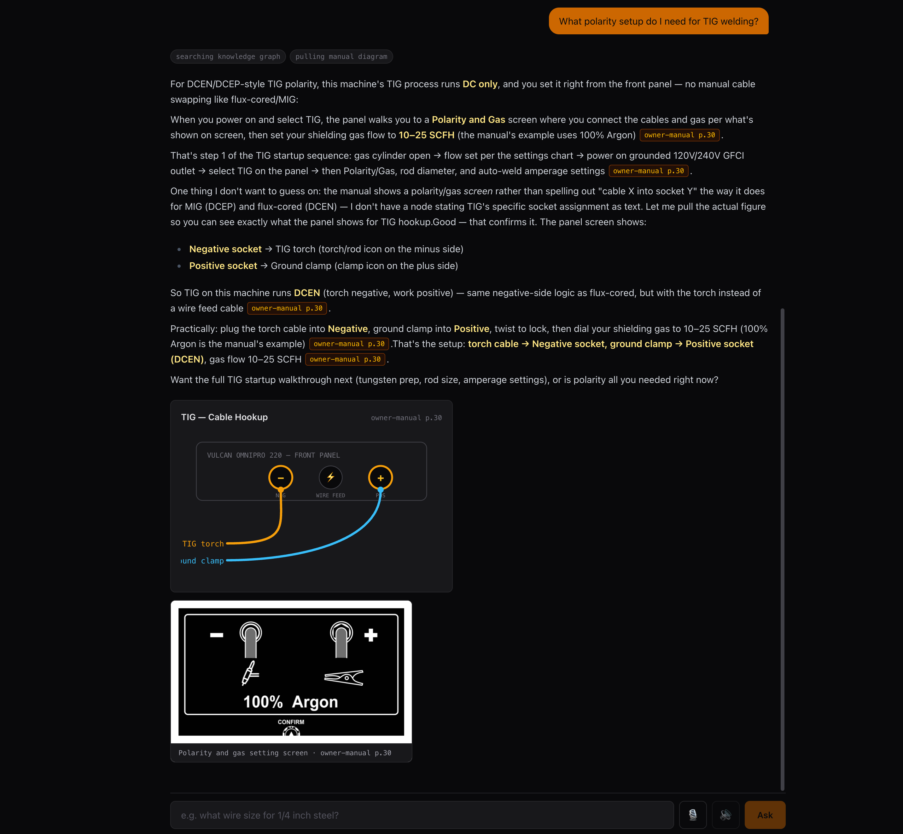
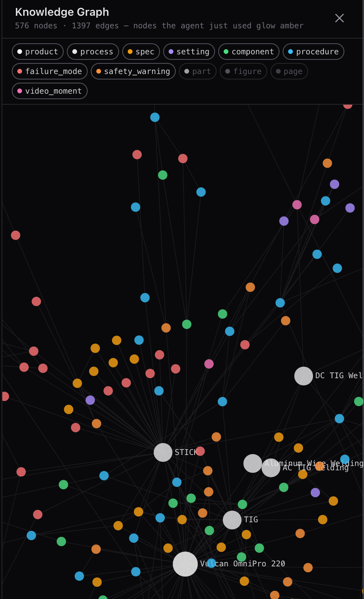
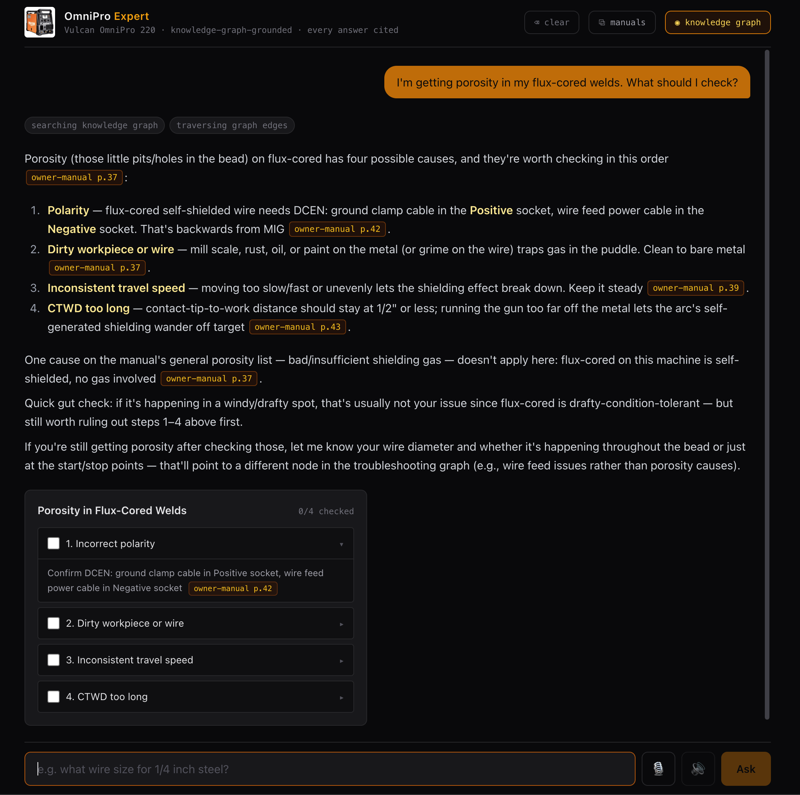

# OmniPro Expert

**A knowledge-graph-grounded multimodal agent for the [Vulcan OmniPro 220](https://www.harborfreight.com/omnipro-220-industrial-multiprocess-welder-with-120240v-input-57812.html) multiprocess welder** — built on the Claude Agent SDK for the [Prox founding-engineer challenge](CHALLENGE.md).

Ask it anything a new owner would ask. It answers like a competent friend in your garage — grounded in the actual documentation, **cited to the page**, showing you the **real manual diagrams**, rendering **interactive widgets** when numbers or decisions are involved, and speaking out loud if you want it to. And you can watch it think: an **interactive knowledge-graph view** shows exactly which nodes light up as it reasons.



 

**Live demo:** [omnipro-expert-6b9s.onrender.com](https://omnipro-expert-6b9s.onrender.com) · access code `prox-omni` · **[Video walkthrough](https://tinyurl.com/mf56jz6m)** _(free-tier host: first load after idle may take ~60s)_

## Run it in under 2 minutes

```bash
git clone https://github.com/Shauryagulati/omnipro-expert.git && cd omnipro-expert
cp .env.example .env      # paste your ANTHROPIC_API_KEY
npm install               # one runtime, ~1 min
npm run dev               # → http://localhost:3000
```

No database, no Python, no model downloads, no ingestion step — the knowledge graph and every manual page/figure image are **precomputed and committed**. Your key is used only to run the agent.

Try these:
- *"What's the duty cycle for MIG welding at 200A on 240V?"* — exact answer + an interactive calculator; drag the slider.
- *"I'm getting porosity in my flux-cored welds."* — an interactive troubleshooting checklist, each step cited.
- *"What polarity for TIG? Which socket does the ground clamp go in?"* — safety note first, then a **drawn cable-hookup diagram** plus the actual manual figure.
- *"Can I TIG weld aluminum?"* — an honest **no** (DC-only machine), with the documented alternative.
- *"What's my duty cycle?"* — it asks which process and voltage instead of guessing.
- Click **◉ knowledge graph** in the header, then ask anything — the nodes it uses glow amber.
- Click 🎙 to ask by voice; toggle 🔊 to have answers spoken as they stream.

## Why a knowledge graph (and deliberately no vector database)

The OmniPro 220's documentation is 51 pages where the dangerous questions are *structured*: duty cycle differs by **process and input voltage**; flux-cored polarity is the **inverse** of MIG; aluminum TIG needs AC output the machine doesn't have. Embedding chunks and ranking by cosine similarity is exactly how you mix the 120V and 240V table rows — plausible text, wrong amps.

So the pipeline compiles the docs into a **typed property graph** (576 nodes, ~1,400 edges):

- **Node types:** `spec`, `procedure`, `failure_mode`, `safety_warning`, `setting`, `component`, `part`, `process`, `figure`, `page`, `video_moment`
- **Edge types:** `causes`, `resolved_by`, `requires`, `differs_by`, `incompatible_with`, `depicted_in`, `documented_on`, `demonstrated_in`, `applies_to`, `part_of`
- **Grounding invariant:** every node carries `sources: [{doc, page, figure_id}]` — *enforced by schema*. A fact without a page reference cannot exist in this system, so citation is guaranteed by construction, not by prompting.

Retrieval is deterministic: alias-aware keyword search finds entry nodes (a build-time LLM pass gave every node the layman vocabulary — "stinger", "the plus plug"), then **typed edges do the semantic work**. "Porosity in flux-cored welds" is answered by walking `failure_mode:porosity → resolved_by → check-polarity → differs_by process → flux-cored inversion → depicted_in → the quick-start diagram`. That's a path, not a lookup — and you can watch it happen in the graph view.

At Prox scale (thousands of manuals, open vocabulary) I'd add a semantic entry-point layer *on top* — the multi-product layout (`data/products/<slug>/`) is where it would slot in. At 51 pages, determinism beats similarity.

## Architecture

```
OFFLINE (Python, pipeline/ — runs once, outputs committed)      RUNTIME (TypeScript — what you just ran)
┌────────────────────────────────────────┐                     ┌────────────────────────────────────────────┐
│ render:  pages → PNG; vector-drawing   │   graph.json        │ Next.js + Claude Agent SDK                 │
│          cluster detection for figures │   page PNGs         │  /api/chat: agent loop, streaming NDJSON   │
│ extract: Claude vision → tables,       │   figure crops      │  tools: search_graph · traverse ·          │
│          figures, key facts (per page) │  ────────────────▶  │   get_figure · get_page · show_widget ·    │
│ graph:   LLM proposals + deterministic │                     │   generate_artifact                        │
│          merge + alias enrichment      │                     │  UI: chat + citation chips + widgets +     │
│ video:   walkthrough → video_moments   │                     │   sandboxed artifacts + graph view + voice │
│ verify:  12-landmark gate              │                     │  MCP server: same graph, any MCP client    │
└────────────────────────────────────────┘                     └────────────────────────────────────────────┘
```

**The agent can only know what the graph knows.** Its built-in tools (file access, bash, web) are disabled; the system prompt forbids stating any spec without retrieval and requires `[doc p.N]` citations, which the UI turns into chips that open the actual page image. When something isn't in the docs, it says so — no general-knowledge filler.

**Multimodal output is tool-driven, not text-parsed.** Five curated widgets (duty-cycle calculator, polarity diagram drawn on the real front-panel layout, troubleshooting checklist, settings configurator, process selector) take **zod-validated props** — the model can't render an invented number; validation errors bounce back for the model to fix. For shapes the widgets don't cover, `generate_artifact` accepts self-contained HTML that must pass a static validator (no external resources, no network calls, size cap) before rendering in a sandboxed iframe — a failed check returns the errors to the model for retry, so a broken render never reaches you.

**Honesty over completeness, one concrete example:** the manual never mentions zinc. An agent that warns about "zinc fumes" when asked about galvanized steel is *hallucinating* — plausibly and dangerously. This one composes what the docs actually contain: the general fume-safety warning (owner-manual p.3) and galvanized steel's flux-cored suitability (selection chart). The landmark gate in the pipeline encodes exactly this distinction.

## Evals

`npm run eval` runs 30 questions through the real agent across seven tiers — the challenge's sample questions, single-fact retrieval, **six hallucination traps**, multi-hop troubleshooting, three questions that must be answered with a clarifying question, three that must be declined, and visual-output checks.

Latest full run — **30/31 (97%)**:

| tier | what it tests | score |
|---|---|---|
| sample | the challenge README's own questions | 3/3 |
| fact | single-value retrieval (duty cycles, OCV, wire sizes…) | 8/8 |
| **trap** | **hallucination bait** (DC-only aluminum, inverted flux polarity, gasless flux, 120V limits…) | **6/6** |
| multihop | troubleshooting requiring edge traversal | 4/4 |
| ambiguous | must ask a clarifying question, not guess | 3/3 |
| scope | must decline (other machines, safety bypasses, legal advice) | 3/3 |
| visual | must show the right figure/widget | 3/4 |

The one miss, for honesty: asked how to set wire-feed tension, the agent gave the exact documented settings (3–5 solid / 2–3 flux-cored, cited, correctly split by wire type) but didn't surface the tensioner diagram alongside. Right facts, missed a show — kept as a failure rather than tuned away.

`npm run smoke` is the 2-minute version (5 questions).

## The extras

- **Interactive knowledge graph** (header ◉): force-directed canvas of all 576 nodes, filter by type, click for data + sources, and live amber glow on the nodes each answer touched.
- **Voice** (🎙/🔊): Web Speech in and out — answers are spoken sentence-by-sentence *as they stream*, and talking or typing interrupts playback. Zero extra keys or downloads; `src/lib/speech.ts` is the documented seam where a hosted TTS/STT or SIP/telephony stack would plug in.
- **Video moments:** the linked walkthrough video is part of the graph — 8 timestamped `video_moment` nodes edge-linked to the procedures they demonstrate; the agent offers `▶ watch` links that jump to the exact second.
- **MCP connector:** `npm run mcp` exposes the graph to Claude Desktop (or any MCP client) over stdio — the same "meet users in the tools they already use" deployment Prox ships. Config snippet in `scripts/mcp-server.ts`.

## Knowledge pipeline

Everything above sits on the offline pipeline in [`pipeline/`](pipeline/README.md) — page rendering with vector-drawing figure detection (this manual's diagrams are line art, not raster images), cell-exact vision extraction, chunked+cached graph construction, and the 12-landmark verification gate. You never need to run it; its outputs are committed. `pipeline/README.md` has the full design.

## Hosted demo access

The hosted instance runs on the author's API key. It's protected in depth: a light **access code** (`prox-omni`) to keep out drive-by bots, a per-visitor **rate limit**, and a hard monthly spend cap on the key itself. Enter the code once when you send the first question. Want unlimited questions? The local setup above takes under 2 minutes with your own key.

## Cost notes

The agent defaults to `claude-sonnet-5` (override with `CLAUDE_MODEL` in `.env`). The system prompt + node catalog is a stable prefix, so the Agent SDK's prompt caching makes follow-up questions in a session substantially cheaper and faster than the first. Typical question: a few cents.

## Project layout

| Path | What |
|---|---|
| `src/agent/` | System prompt, MCP tool server, artifact validator, agent loop |
| `src/lib/graph.ts` | Graph load / deterministic search / typed traversal |
| `src/components/` | Chat, citation chips, page modal, widgets, graph view, voice |
| `src/app/api/` | Streaming chat route, graph API |
| `data/products/vulcan-omnipro-220/` | graph.json, per-page extraction, video moments |
| `public/products/vulcan-omnipro-220/` | Page renders (150dpi), figure crops (300dpi) |
| `pipeline/` | Offline Python pipeline (see its README) |
| `evals/` + `scripts/` | Eval suite, smoke test, MCP server |
